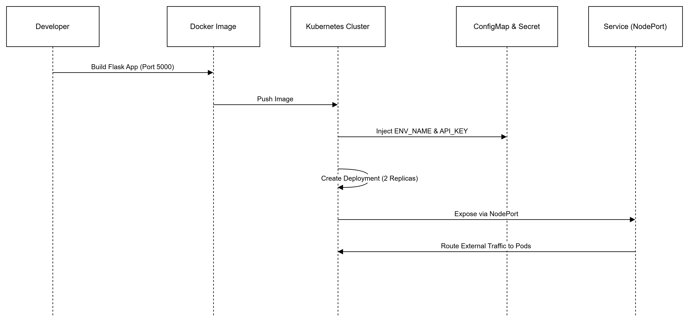

# Kubernetes Fundamentals
## _Flask App on Minikube_
## :bookmark: Status: Complete


This project demonstrates how to containerise a Python Flask application, package it as a Docker image, and deploy it onto Kubernetes using Minikube. It covers the essential Kubernetes building blocks: Deployments, Services, ConfigMaps, Secrets, resource governance, and health probes — forming a solid foundation for real‑world cluster operations.

---

## :bricks: What This Project Builds

A complete, working Kubernetes deployment consisting of:

- A Python Flask web application  
- A Docker image (`flask-k8s-app:v1`)  
- A Kubernetes Deployment running **2 replicas**  
- A NodePort Service exposing the app externally  
- A ConfigMap for non‑sensitive configuration  
- A Secret for sensitive values  
- Liveness and readiness probes  
- Resource requests and limits  
- A demonstration of Kubernetes self‑healing  

This mirrors the workflow used in production environments.

---

## :world_map: Architecture Overview



### Component Breakdown

| Component | Description |
|----------|-------------|
| **Flask App** | Simple Python API running on port 5000 |
| **Docker Image** | Containerised version of the app |
| **Deployment** | Runs 2 replicas, manages rollout + self‑healing |
| **ConfigMap** | Stores non‑sensitive config (`ENV_NAME`) |
| **Secret** | Stores sensitive values (`API_KEY`) |
| **Service (NodePort)** | Exposes the app externally via Minikube |


---

## 🔁 Self‑Healing Demonstration

Kubernetes Deployments maintain the desired number of replicas automatically.

### Test performed:

```bash
kubectl delete pod <pod-name>
```

### What happened:
Kubernetes detected that only 1 pod was running
The ReplicaSet immediately created a new pod
The system returned to the desired state of 2 replicas
This showcases Kubernetes’ reconciliation loop — one of its most powerful features.

## 📦 Resource Requests & Limits (Why They Matter)
The Deployment defines:
```yaml
resources:
  requests:
    cpu: "100m"
    memory: "128Mi"
  limits:
    cpu: "500m"
    memory: "256Mi"
```

### Why this is important:
  - Requests guarantee a minimum amount of CPU/memory
  - Limits cap how much a pod can consume
  - Prevents “noisy neighbour” issues
  - Ensures fair resource distribution
  - Helps Kubernetes schedule pods intelligently
  - This is a key concept in cluster reliability and cost control.


### ❤️ Liveness & Readiness Probes
The Deployment includes:

```yaml
livenessProbe:
  httpGet:
    path: /
    port: 5000

readinessProbe:
  httpGet:
    path: /
    port: 5000
```

### Why probes matter:
  - Readiness probe ensures traffic is only sent to pods that are ready
  - Liveness probe restarts pods that become unresponsive
  - Prevents broken pods from receiving traffic
  - Improves uptime and reliability
  - Without probes, Kubernetes cannot safely manage pod lifecycle or traffic routing.

## 🌐 Accessing the Application (NodePort Service)
The Service exposes the app externally via Minikube.

Get the URL:
```bash
minikube service flask-app-service --url
```

Example output:

```
http://127.0.0.1:31732
```

Opening this in a browser shows:

```
Hello from Kubernetes! ENV=development, API_KEY_PRESENT=True
```

This confirms the Service is routing traffic to your pods.

## 🚀 What I Would Add Next
The next logical enhancements are:

1. Ingress Controller
Clean URLs (no NodePort)
TLS/HTTPS termination
Routing multiple services under one domain

2. Horizontal Pod Autoscaler (HPA)
Automatically scale pods based on CPU or custom metrics
To Demonstrate elasticity and cost‑efficiency

3. Helm Chart
Package all manifests into a reusable chart
Parameterise values for different environments
Industry‑standard deployment method

These additions elevate the project into a full platform‑engineering showcase.


## 📁 Repository Structure
```
kubernetes-fundamentals/
├── app/
│   ├── app.py
│   ├── requirements.txt
│   └── Dockerfile
└── k8s/
    ├── configmap.yaml
    ├── secret.yaml
    ├── deployment.yaml
    └── service.yaml

```
## :blue_book: Commands Summary
Build & load image into Minikube
```bash
docker build -t flask-k8s-app:v1 .
minikube image load flask-k8s-app:v1
```

Apply Kubernetes manifests
```bash
kubectl apply -f k8s/
```

Access the app
```bash
minikube service flask-app-service --url
```

## 🛠️ CI/CD Pipeline (Code → Lint → Build → Test → Push → Scan)

A recommended CI/CD workflow for this project:

1. Code commit to Git repository
2. Static linting (e.g., `flake8`, `pylint`) and formatting checks (`black`)
3. Build Docker image (`docker build`) and run unit tests in container
4. Push image to container registry (Docker Hub / ECR / GCR)
5. Security scan of the image (e.g., Trivy, Clair)
6. Apply Kubernetes manifests via `kubectl` or Helm deploy

This pipeline ensures that changes are validated fast, built reproducibly, tested before deploy, and scanned for vulnerabilities.

